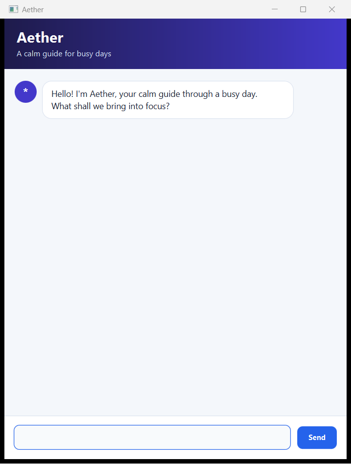

# Aether User Guide

Aether is a calm desktop task chatbot for students who prefer fast, typed commands. It keeps todos,
deadlines, and events in a local data file, so they are still available the next time Aether starts.

## Quick start

1. Install Java 25.
2. Download `aether.jar` from the latest GitHub release.
3. Open a terminal in the folder containing the JAR and run `java -jar aether.jar`.
4. Type a command in Aether and press `Enter` or click **Send**.

Dates use `yyyy-MM-dd`, such as `2026-09-18`. Aether saves successful changes automatically.

## Command summary

| Action | Command format | Example |
| --- | --- | --- |
| Add a todo | `todo DESCRIPTION` | `todo review lecture notes` |
| Add a deadline | `deadline DESCRIPTION /by DATE` | `deadline submit iP /by 2026-09-18` |
| Add an event | `event DESCRIPTION /from DATE /to DATE` | `event workshop /from 2026-09-16 /to 2026-09-17` |
| Show all tasks | `list` | `list` |
| Find tasks | `find KEYWORD` | `find report` |
| Sort dated tasks | `sort` | `sort` |
| Mark a task done | `mark TASK_NUMBER` | `mark 2` |
| Mark a task pending | `unmark TASK_NUMBER` | `unmark 2` |
| Delete a task | `delete TASK_NUMBER` | `delete 2` |
| Exit Aether | `bye` | `bye` |

## Adding tasks

Descriptions must not be empty. For deadlines, put one `/by` marker between the description and due
date. For events, put one `/from` marker before the start date and one `/to` marker before the end
date. An event's end date must be later than its start date.

Aether rejects an exact duplicate task, ignoring capitalization in its description. Two deadlines
with different due dates, or two events with different date ranges, are treated as different tasks.

## Viewing and finding tasks

`list` shows every task and its current number. The symbols are:

- `[T]` — todo
- `[D]` — deadline
- `[E]` — event
- `[ ]` — pending
- `[X]` — completed

`find KEYWORD` searches descriptions without regard to capitalization. Search results retain their
numbers from the full list, so a displayed number can be used directly with `mark`, `unmark`, or
`delete`.

## Updating tasks

Use the number shown by `list` or `find`:

- `mark TASK_NUMBER` changes a task to completed.
- `unmark TASK_NUMBER` changes it back to pending.
- `delete TASK_NUMBER` permanently removes it.

After a deletion or sort, run `list` again before using another task number because the order may
have changed.

## Sorting tasks

`sort` places events by start date and deadlines by due date, earliest first. Tasks with the same
date keep their existing order. Todos have no date, so they appear after dated tasks. The sorted
order is saved automatically.

## If a command is rejected

Invalid input appears in a red reply bubble with a correction and example. A rejected command never
changes the task list. Common fixes include:

- Use a real date in `yyyy-MM-dd` format; for example, February 30 is not valid.
- Use each date marker once and leave spaces around it.
- Put `/from` before `/to`, with the `/to` date later than the `/from` date.
- Give `mark`, `unmark`, and `delete` one whole-number task number.
- Type `list` to check the current task numbers.

If Aether reports that its saved data cannot be read, repair or remove `data/aether.txt`, restart
Aether, and then try the command again. Aether protects the unreadable file from being overwritten.
